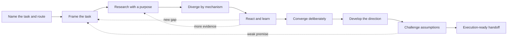
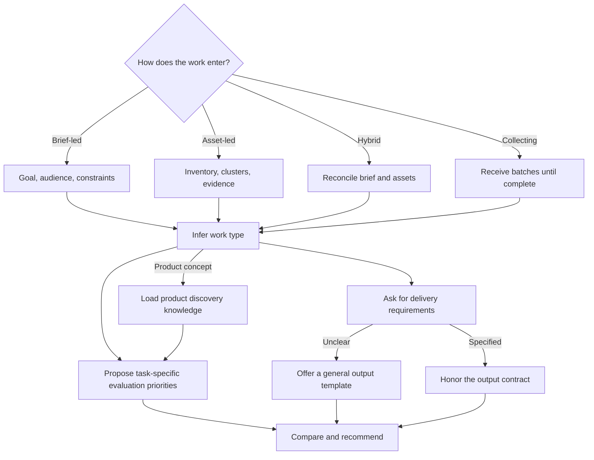

# Creative Work Helper

An adaptive Codex skill that guides people from fuzzy creative tasks, messy existing materials, or early product ideas to clear, evidence-informed, testable, and executable directions.

You do not need to know the planning process before using it. The skill names the kind of task it sees, explains the short route ahead, asks only the question that matters now, and makes progress visible as the work moves through multiple rounds. A complete brief is welcome but not required.

## When to use it

Use Creative Work Helper when you need to:

- turn a rough intention into a content, campaign, event, or creative-system direction;
- discover what a collection of photos, footage, copy, constraints, or partial ideas can credibly support;
- find and interpret references without copying their surface expression;
- create genuinely different directions, then compare and develop them;
- diagnose why an existing idea feels generic, incoherent, unsupported, or impractical;
- explore and validate an early product, service, feature, or interaction concept.

Skip it when the brief and output are already complete and you only need a simple one-shot production task. Product discovery support ends at an evidence-informed concept and validation plan; detailed UI, full PRDs, roadmaps, and engineering implementation belong in a subsequent workflow.

## What it does

- Builds the smallest workable brief through targeted questions.
- Tracks brief items as **Confirmed**, **Tentative**, or **Open**.
- Supports brief-led, asset-led, hybrid, and collecting workflows.
- Researches transferable mechanisms rather than examples to copy.
- Generates directions that differ in how they work, not merely in wording or style.
- Learns from positive, negative, and uncertain feedback across rounds.
- Selects evaluation priorities according to the work type—there is no universal ranking.
- Asks for the required deliverable; when it is unclear, proposes a suitable general template.
- Separates system invariants, variables, and boundaries for repeatable creative systems.
- Stress-tests assumptions, label–evidence fit, feasibility, and risk before handoff.
- Guides product discovery through problem evidence, concept mechanisms, product risks, and learning-focused prototypes.

## Collaboration flow

The workflow is adaptive: it can move backward or sideways when feedback reveals a better question.



The skill gives a lightweight **Settled / Now / Next** cue only when the stage meaningfully changes. It does not turn every response into a process dashboard, and the user can always ask to research first, generate directions now, skip a step, or produce a one-pass plan with explicit assumptions.

## Adaptive routing

Evaluation criteria and output structure are selected from the actual job, not imposed as personal defaults.



## What the first interaction looks like

```text
User
I want to plan a campus event, but I don't know where to start.

Creative Work Helper
This is an early event-planning task. I can help you clarify the intended
audience change, explore several participation mechanisms, compare them,
and develop the selected direction into an executable event concept.

You do not need to know the process or answer everything now. We'll start
with the decision that changes the direction most: after attending, what
should people do or feel differently?
```

If the user instead says “give me a complete proposal now,” the skill proceeds in one pass and labels the assumptions it had to make.

## How a multi-round collaboration develops

```text
Round 1 — Frame
Confirmed: prospective international students
Open: whether the content should explain, inspire, or invite participation

Round 2 — Explore
Research mechanisms and present a few structurally different direction cards

Round 3 — Learn from feedback
Preserve the mechanism the user liked, reject the unwanted treatment,
and record why the choice changed

Round 4 — Develop and challenge
Build the selected direction, expose its assumptions and risks, and prepare
the requested handoff package
```

## Product concept example

```text
User
I want to design an app that helps students find people to study with.

Creative Work Helper
This is a product discovery and concept-design task. Before deciding on
features, we'll check the situation and evidence, define the opportunity,
compare different matching or coordination mechanisms, and choose the
cheapest prototype that can test the highest-risk assumption.

What have you observed that shows finding a partner—rather than scheduling,
trust, subject fit, or maintaining commitment—is the central problem?
```

When evidence is unavailable, the skill marks the proposed problem as **Tentative** and designs a low-cost way to learn rather than presenting the assumption as an insight.

## Install

Clone this repository, then copy the skill directory into your Codex skills directory:

```bash
git clone https://github.com/Cathde/creative-work-helper.git
mkdir -p ~/.codex/skills
cp -R creative-work-helper/creative-work-helper ~/.codex/skills/
```

Restart Codex if the skill is not discovered immediately.

## Use

Invoke it explicitly:

```text
Use $creative-work-helper to guide me from this rough idea to a clear,
testable, executable direction: ...
```

It should also trigger naturally for content planning, campaigns, event concepts, creative briefs, format or style exploration, brainstorming, material selection and grouping, visual/content systems, direction comparison, critique, and early product discovery.

## Repository structure

```text
creative-work-helper/
├── README.md
├── LICENSE
└── creative-work-helper/
    ├── SKILL.md
    ├── agents/
    │   └── openai.yaml
    └── references/
        ├── brief-and-questioning.md
        ├── creative-state.md
        ├── evaluation-and-critique.md
        ├── ideation-and-routing.md
        ├── product-discovery-and-concept-design.md
        ├── research-strategies.md
        └── work-types-and-deliverables.md
```

## 中文简介

Creative Work Helper 是一个面向开放式创意与早期产品概念任务的协作型 Skill。用户不需要提前理解策划流程，也不需要一次提供完整 brief。Skill 会先说明它识别到的任务、可能的产物和接下来的短路线，再从当前最重要的问题开始。

适合用在：从模糊想法开始策划、从已有素材提炼方向、搜索并转化参考机制、比较或挽救已有创意，以及验证早期产品或服务概念。不适合用在要求已经完全明确的简单执行，也不负责详细 UI、完整 PRD、产品路线图或工程实现。

两个关键设计原则：

1. **不同类型的 creative work 使用不同的评估优先级。** Skill 会根据任务目标、阶段和限制提出暂定排序，并允许用户调整，不预设个人化的统一权重。
2. **交付模板跟随任务变化。** Skill 会先询问交付要求；如果用户不明确，再根据任务类型提出一套通用模板供删改。
3. **过程应该被用户感知，但不打断对话。** 首次进入会说明路线，阶段变化时才显示“已明确 / 当前 / 下一步”，用户可以随时跳过、搜索或要求直接成案。
4. **产品假设不能伪装成用户洞察。** 没有证据时会标记为 Tentative，并优先设计最低成本的验证方法。

## License

[MIT](LICENSE)
