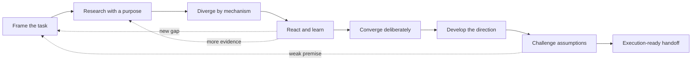
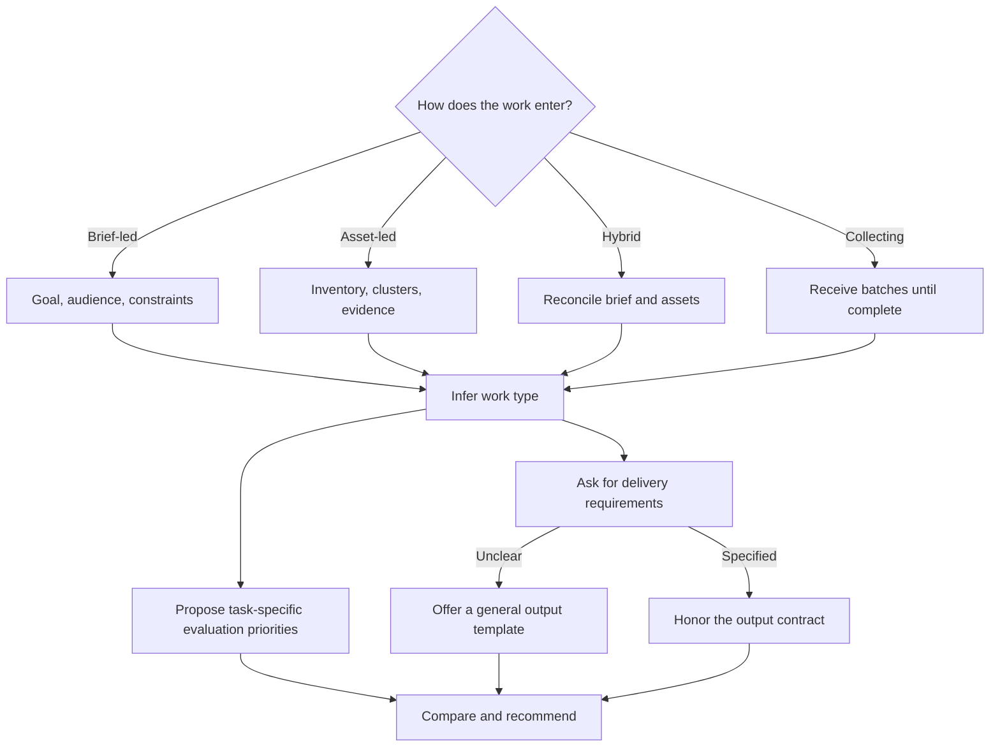

# Creative Work Helper

An adaptive Codex skill that turns fuzzy creative tasks—or messy existing materials—into clear, evidence-informed, executable creative directions.

It behaves as a creative facilitator, researcher, planner, and critic. Instead of immediately producing a pile of ideas, it clarifies the few unknowns that matter, preserves useful ambiguity, researches references with a purpose, explores structurally different mechanisms, learns from feedback, and develops the selected direction into an appropriate deliverable.

## What it does

- Builds the smallest workable brief through targeted questions.
- Tracks brief items as **Confirmed**, **Tentative**, or **Open**.
- Supports brief-led, asset-led, hybrid, and collecting workflows.
- Researches transferable mechanisms rather than examples to copy.
- Generates directions that differ in how they work, not merely in wording or style.
- Learns from positive, negative, and uncertain feedback across rounds.
- Selects evaluation priorities according to the work type—there is no universal ranking.
- Asks for the required deliverable; when it is unclear, proposes a suitable general template.
- Separates system invariants, variables, and boundaries for repeatable creative systems.
- Stress-tests assumptions, label–evidence fit, feasibility, and risk before handoff.

## Collaboration flow

The workflow is adaptive: it can move backward or sideways when feedback reveals a better question.



## Adaptive routing

Evaluation criteria and output structure are selected from the actual job, not imposed as personal defaults.



## Install

Clone this repository, then copy the skill directory into your Codex skills directory:

```bash
git clone https://github.com/Cathde/creative-work-helper.git
mkdir -p ~/.codex/skills
cp -R creative-work-helper/creative-work-helper ~/.codex/skills/
```

Restart Codex if the skill is not discovered immediately.

## Use

Invoke it explicitly:

```text
Use $creative-work-helper to help me plan a campaign for...
```

It should also trigger naturally for content planning, campaigns, event concepts, creative briefs, format or style exploration, brainstorming, material selection and grouping, visual/content systems, direction comparison, critique, and concept development.

## Repository structure

```text
creative-work-helper/
├── README.md
├── LICENSE
└── creative-work-helper/
    ├── SKILL.md
    ├── agents/
    │   └── openai.yaml
    └── references/
        ├── brief-and-questioning.md
        ├── creative-state.md
        ├── evaluation-and-critique.md
        ├── ideation-and-routing.md
        ├── research-strategies.md
        └── work-types-and-deliverables.md
```

## 中文简介

Creative Work Helper 是一个面向开放式创意任务的协作型 Skill。它不会在信息不足时直接输出一堆点子，而是帮助用户逐步完成需求澄清、参考研究、创意发散、反馈学习、方案收敛、执行展开与风险检查。

两个关键设计原则：

1. **不同类型的 creative work 使用不同的评估优先级。** Skill 会根据任务目标、阶段和限制提出暂定排序，并允许用户调整，不预设个人化的统一权重。
2. **交付模板跟随任务变化。** Skill 会先询问交付要求；如果用户不明确，再根据任务类型提出一套通用模板供删改。

## License

[MIT](LICENSE)
